# 📚 Trackly Development Bible

> Guide complet du workflow de développement et historique des décisions

---

## 📅 Chronologie des Actions

### 2026-02-14 - Session de développement

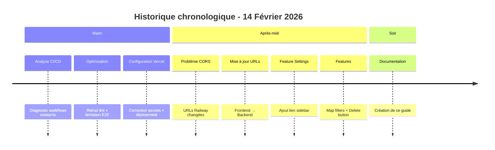

---

## 🧠 Chemin de Pensée (Thought Process)

### Pattern de résolution de problèmes

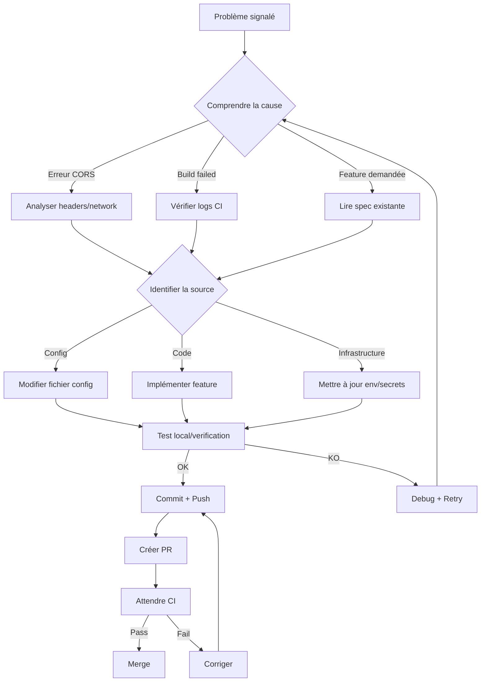

### Exemple concret : Résolution CORS

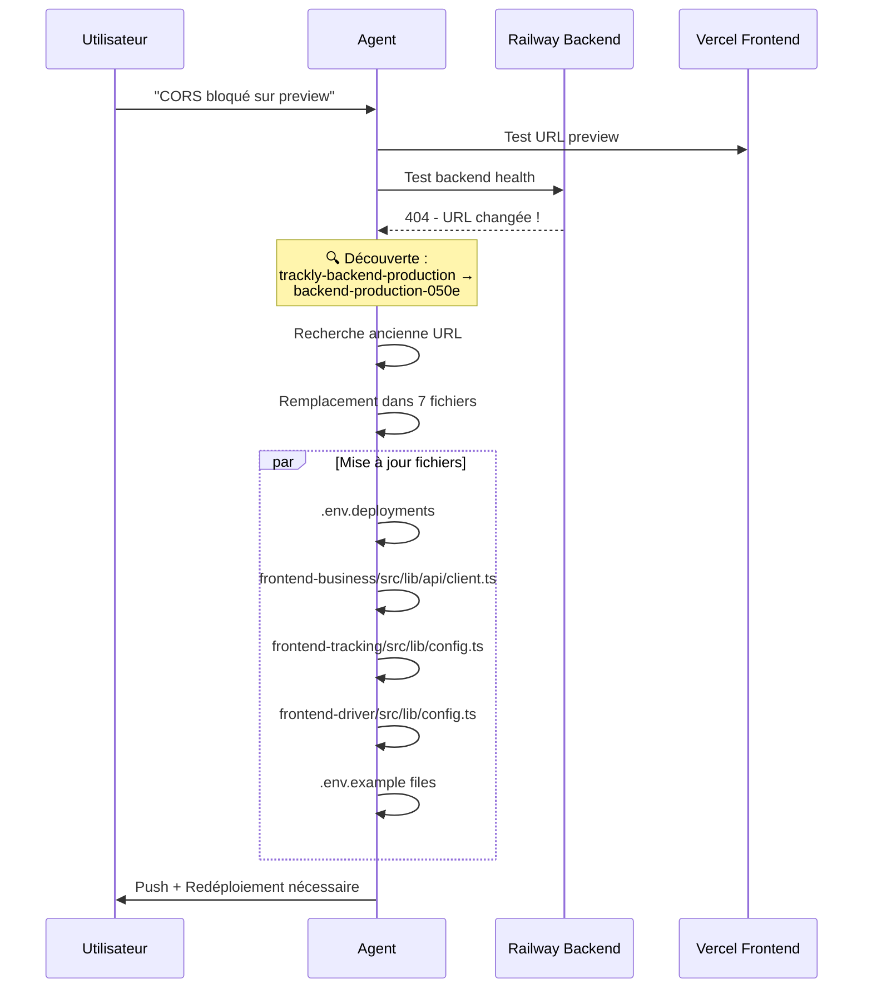

---

## 🔄 Workflow de Développement

### Le Cycle Complet

```mermaid
flowchart LR
    subgraph "1. INPUT"
        P[Prompt Utilisateur]
    end
    
    subgraph "2. ANALYSE"
        A[Lire contexte]
        B[Identifier fichiers]
        C[Planifier changements]
    end
    
    subgraph "3. DÉVELOPPEMENT"
        D[Créer branche feature/]
        E[Implémenter]
        F[Test local]
    end
    
    subgraph "4. LIVRAISON"
        G[Commit conventionnel]
        H[Push origin]
        I[Créer PR]
    end
    
    subgraph "5. ATTENTE"
        J{CI passe ?}
        K[Build OK]
        L[Build FAIL]
    end
    
    subgraph "6. VALIDATION"
        M[Review utilisateur]
        N[Tester preview]
    end
    
    subgraph "7. MERGE"
        O[Merge vers develop]
        Q[Supprimer branche]
    end
    
    P --> A --> B --> C --> D --> E --> F --> G --> H --> I --> J
    J -->|Oui| K --> M --> N --> O --> Q
    J -->|Non| L --> E
    N -->|Corrections| E
```

### Workflow Git Détaillé

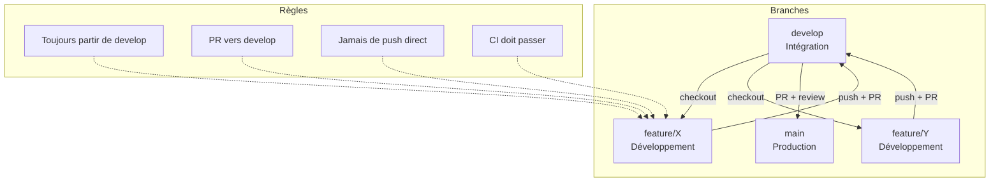

---

## 📋 Conventions de Commit

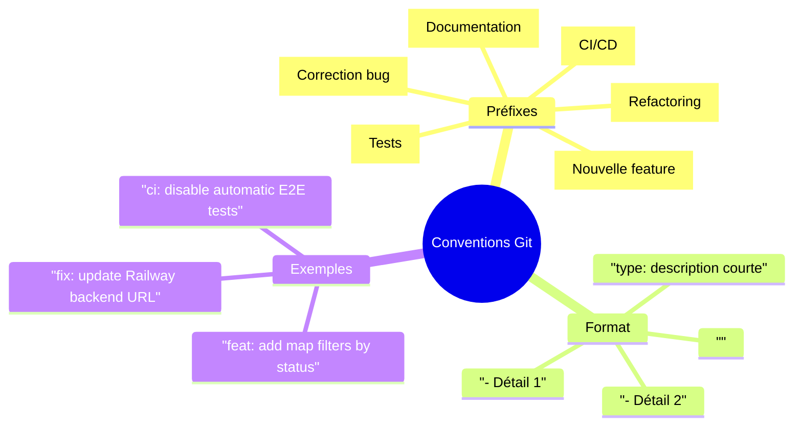

---

## 🏗️ Architecture des Workflows CI/CD

### Vue d'ensemble

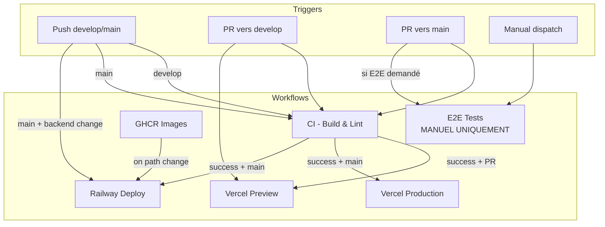

### Séquence de Déploiement

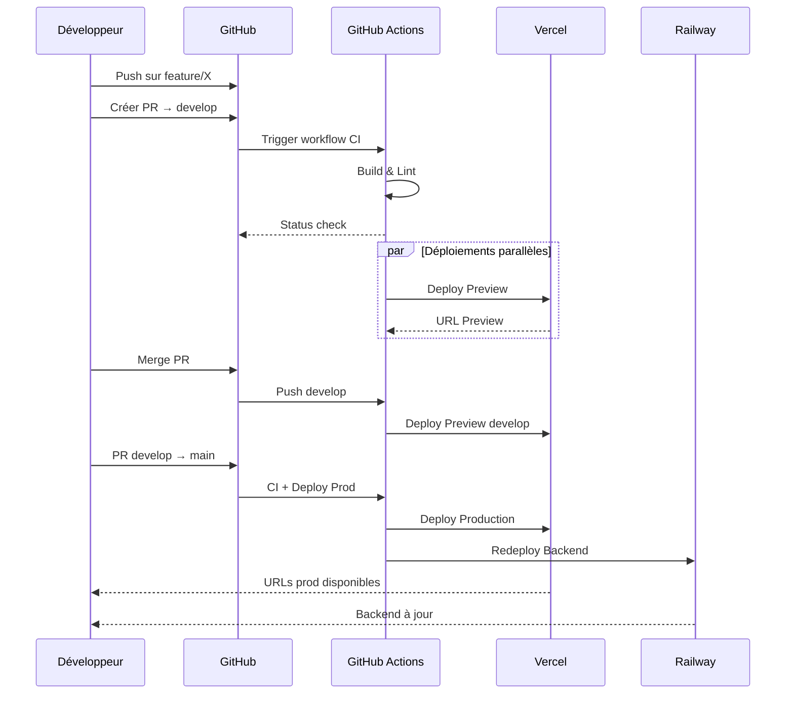

---

## 🎯 Checklist de Développement

### Avant de commencer

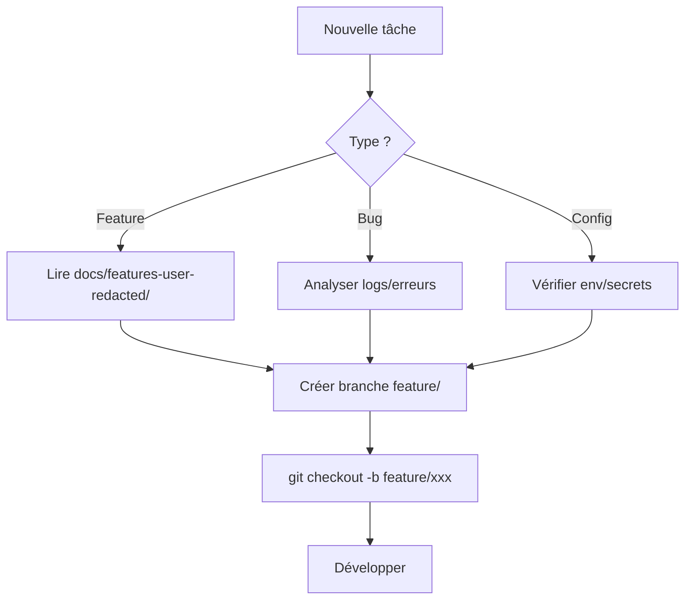

### Avant chaque commit

```markdown
- [ ] Code testé localement
- [ ] Pas de console.log ou debug
- [ ] Types TypeScript corrects
- [ ] Pas d'erreurs de lint (si activé)
- [ ] Message de commit conventionnel
```

### Avant de demander review

```markdown
- [ ] CI passe (Build OK)
- [ ] Pas de conflits avec develop
- [ ] Description de PR claire
- [ ] Lien vers feature doc si applicable
- [ ] Screenshots si UI modifiée
```

---

## 🚨 Résolution des Problèmes Courants

### CI Failed

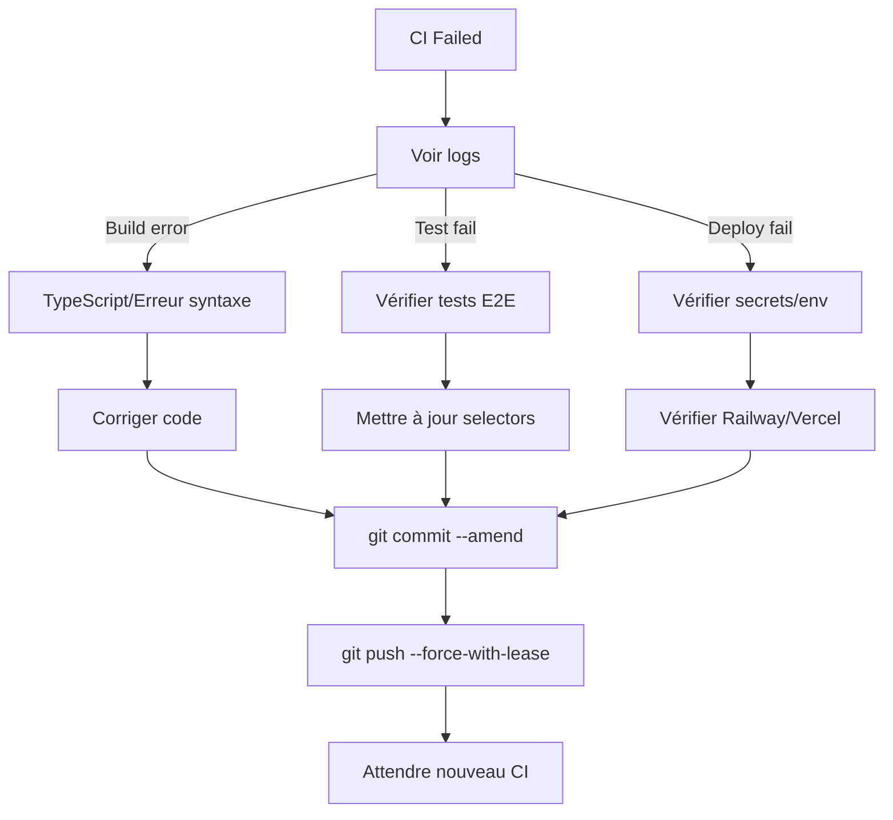

### CORS Issues

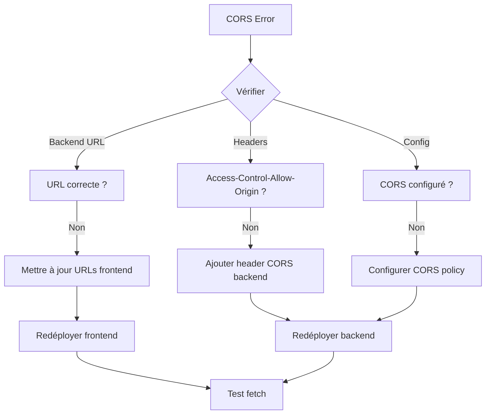

---

## 📝 Structure des Fichiers de Feature

```
docs/features-user-redacted/
├── feature-xxx.md          # Spec complète
├── improvement-xxx.md      # Amélioration
├── bugfix-xxx.md           # Correction
└── misc.md                 # Divers

Pour chaque feature :
- Description
- Fichiers concernés
- Implémentation step-by-step
- Tests à faire
```

---

## 🔗 Liens Rapides

- **Repo** : https://github.com/sbourbousse/Trackly
- **Backend** : https://backend-production-050e.up.railway.app
- **Vercel Dashboard** : https://vercel.com/sbourbousses-projects
- **Railway Dashboard** : https://railway.app/dashboard

---

## 🎓 Leçons Apprises

### Ce qui marche
1. **Feature branches** : Une branche = une feature
2. **Commits petits** : Facile à reviewer et revert
3. **CI comme garde-fou** : Jamais merger si CI fail
4. **Variables d'env** : Toujours vérifier Railway/Vercel

### Ce qui ne marche pas
1. ❌ Merger sans attendre CI
2. ❌ Modifier directement sur main
3. ❌ Oublier de mettre à jour URLs après changement Railway
4. ❌ Laisser les E2E actifs sur chaque PR (trop lent)

### Bonnes pratiques établies
1. ✅ E2E uniquement manuel
2. ✅ Preview Vercel sur chaque PR
3. ✅ Backend Railway séparé des frontends
4. ✅ CORS avec patterns pour les URLs de preview

---

*Dernière mise à jour : 2026-02-14*
*Prochaine review : À chaque nouvelle feature*
