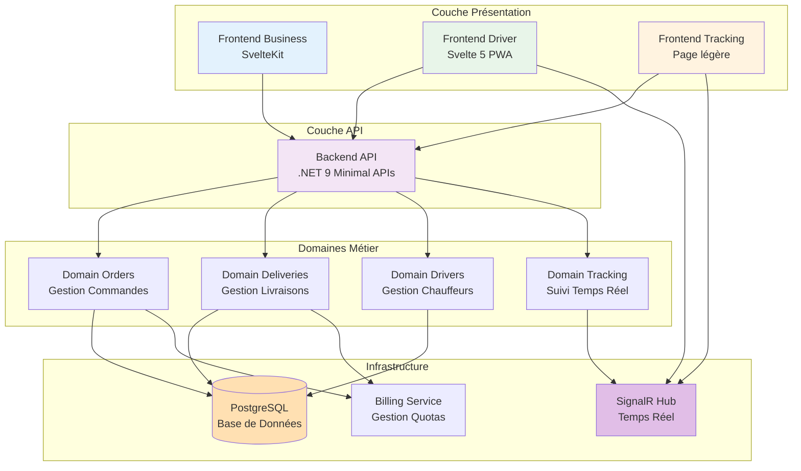
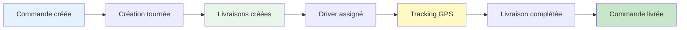
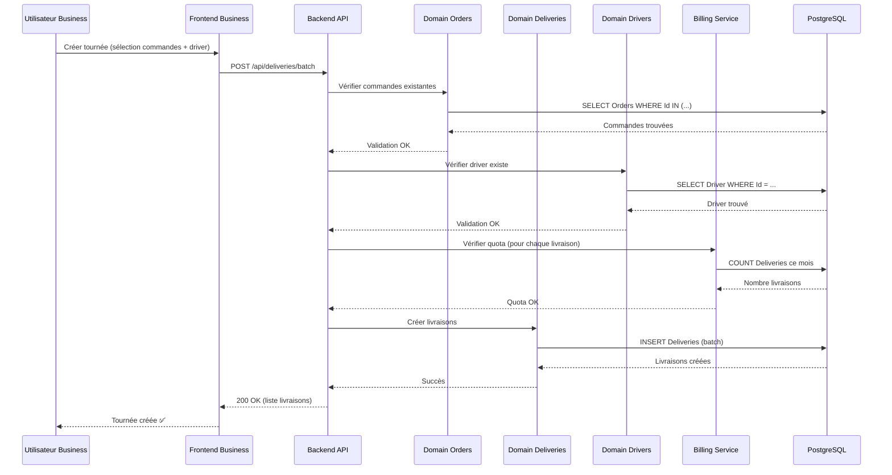
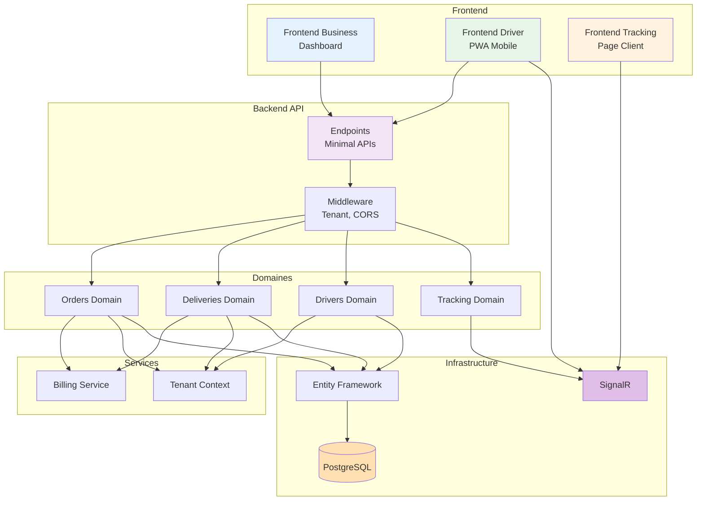
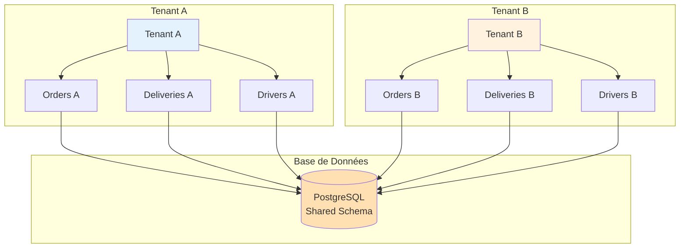

# Architecture Métier - Trackly

## Vue d'ensemble du Domaine

Trackly est organisé autour de quatre domaines métier principaux, chacun géré dans un module séparé.

## Diagramme d'Architecture Métier



## Organisation par Domaines

### 1. Domain Orders (Commandes)

**Responsabilité** : Gestion du cycle de vie des commandes.

**Entités** :
- `Order` : Commande client

**Endpoints** :
- `POST /api/orders` : Créer une commande
- `POST /api/orders/import` : Importer des commandes (CSV)
- `GET /api/orders` : Lister les commandes
- `GET /api/orders/{id}` : Détail d'une commande
- `DELETE /api/orders/{id}` : Supprimer une commande
- `POST /api/orders/batch/delete` : Supprimer plusieurs commandes

**Règles métier** :
- Vérification quota avant création
- Soft delete avec vérification dépendances
- Statut automatique selon livraisons

### 2. Domain Deliveries (Livraisons)

**Responsabilité** : Gestion des livraisons et tournées.

**Entités** :
- `Delivery` : Livraison individuelle

**Endpoints** :
- `GET /api/deliveries` : Lister les livraisons
- `POST /api/deliveries` : Créer une livraison
- `POST /api/deliveries/batch` : Créer plusieurs livraisons (tournée)
- `PATCH /api/deliveries/{id}/complete` : Compléter une livraison
- `DELETE /api/deliveries/{id}` : Supprimer une livraison
- `POST /api/deliveries/batch/delete` : Supprimer plusieurs livraisons
- `GET /api/deliveries/{id}/tracking` : Suivi d'une livraison

**Règles métier** :
- Vérification quota avant création
- Suppression indépendante de la commande
- Tracking GPS temps réel

### 3. Domain Drivers (Chauffeurs)

**Responsabilité** : Gestion des chauffeurs.

**Entités** :
- `Driver` : Chauffeur

**Endpoints** :
- `GET /api/drivers` : Lister les chauffeurs

**Règles métier** :
- Isolation par tenant
- Pas de soft delete (à implémenter si nécessaire)

### 4. Domain Tracking (Suivi Temps Réel)

**Responsabilité** : Communication temps réel pour le suivi GPS.

**Composants** :
- `TrackingHub` : Hub SignalR
- `ITrackingClient` : Interface typée pour les clients

**Méthodes SignalR** :
- `JoinDeliveryGroup(deliveryId)` : Rejoindre un groupe de suivi
- `UpdateLocation(deliveryId, lat, lng)` : Mettre à jour la position

**Règles métier** :
- Isolation par tenant dans le Hub
- Broadcast à tous les clients du groupe
- Reconnexion automatique

## Flux de Données Principal



## Diagramme de Séquence : Création Tournée Complète



## Diagramme de Composants



## Isolation et Sécurité

### Multi-Tenancy



**Principe** : Shared Database, Shared Schema avec isolation par `TenantId`.

## Patterns Utilisés

### 1. Feature-Based Organization

**Structure** :
```
Features/
  ├── Orders/
  ├── Deliveries/
  ├── Drivers/
  └── Tracking/
```

**Avantages** :
- Séparation claire des responsabilités
- Facilite la maintenance
- Scalabilité

### 2. Minimal APIs

**Approche** : Endpoints définis dans des classes statiques.

**Exemple** :
```csharp
public static class OrderEndpoints
{
    public static IEndpointRouteBuilder MapOrderEndpoints(...)
    {
        group.MapGet("/", GetOrders);
        group.MapPost("/", CreateOrder);
        // ...
    }
}
```

### 3. Global Query Filters

**Implémentation** : Filtrage automatique par `TenantId` dans Entity Framework.

**Avantage** : Isolation garantie au niveau ORM.

### 4. Soft Delete

**Implémentation** : Champ `DeletedAt` nullable sur toutes les entités.

**Avantage** : Historique complet et possibilité de restauration.
