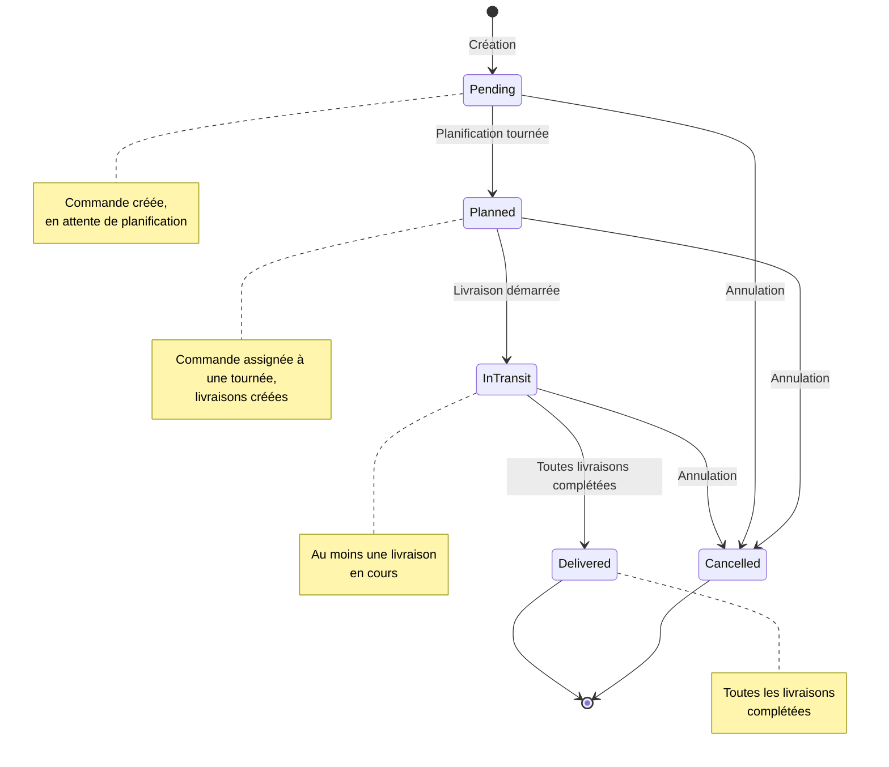
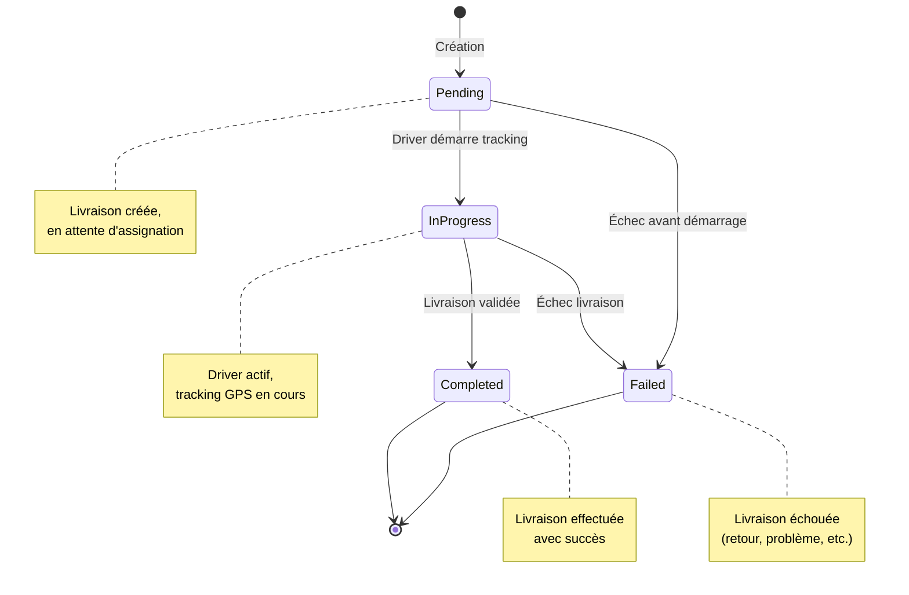
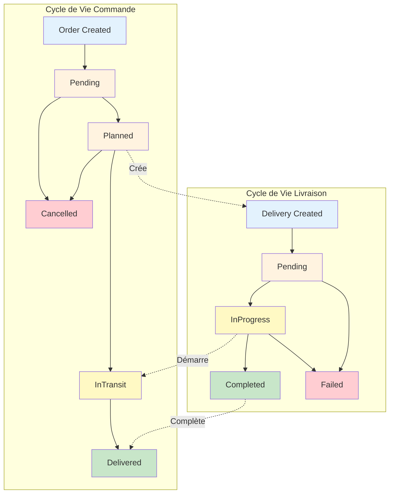
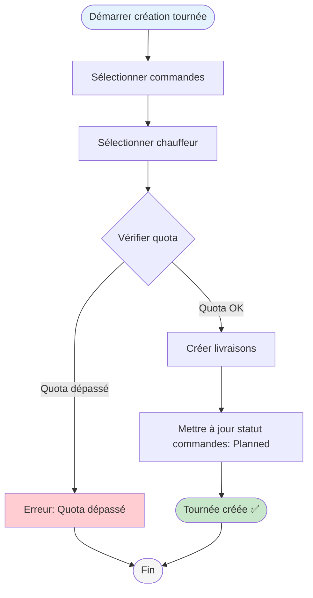
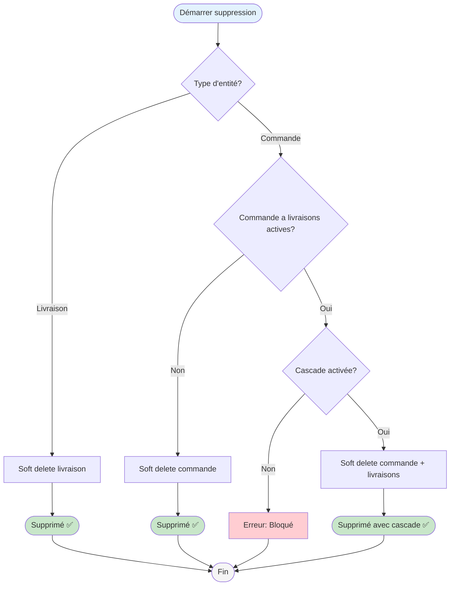

# États et Transitions - Trackly

## Machine à États : Commande (Order)

### États de Commande

| État | Code | Description | Actions possibles |
|------|------|-------------|------------------|
| **Pending** | 0 | En attente | Créer livraison, Annuler |
| **Planned** | 1 | Planifiée | Démarrer livraison, Annuler |
| **InTransit** | 2 | En transit | Compléter livraison |
| **Delivered** | 3 | Livrée | Aucune (état final) |
| **Cancelled** | 4 | Annulée | Aucune (état final) |

## Machine à États : Livraison (Delivery)

### États de Livraison

| État | Code | Description | Actions possibles |
|------|------|-------------|------------------|
| **Pending** | 0 | Prévue | Démarrer tracking, Supprimer |
| **InProgress** | 1 | En cours | Compléter, Arrêter tracking |
| **Completed** | 2 | Livrée | Aucune (état final) |
| **Failed** | 3 | Échouée | Aucune (état final) |

## Diagramme de Transitions Complet

## Règles de Transition

### Commandes

1. **Pending → Planned** : Quand une livraison est créée pour cette commande
2. **Planned → InTransit** : Quand au moins une livraison passe à `InProgress`
3. **InTransit → Delivered** : Quand toutes les livraisons sont `Completed`
4. **Any → Cancelled** : Annulation manuelle (sauf si déjà `Delivered`)

### Livraisons

1. **Pending → InProgress** : Quand le driver démarre le tracking GPS
2. **InProgress → Completed** : Quand le driver valide la livraison
3. **Any → Failed** : En cas d'échec (retour, problème, etc.)

## Diagramme de Flux : Création Tournée

## Diagramme de Flux : Suppression avec Dépendances

