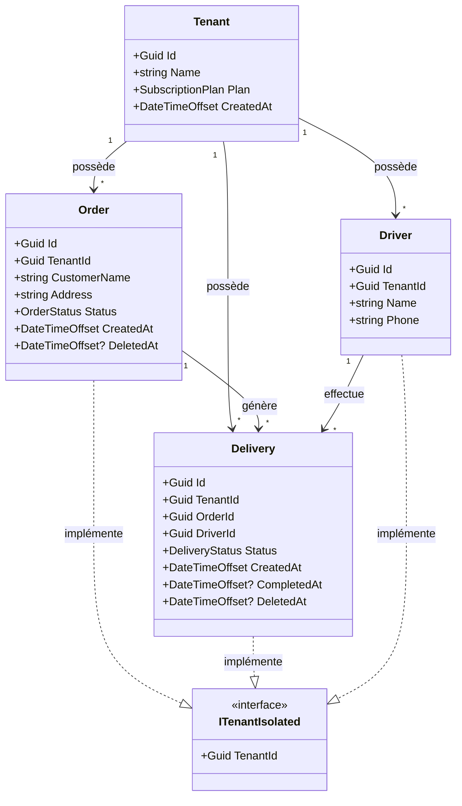
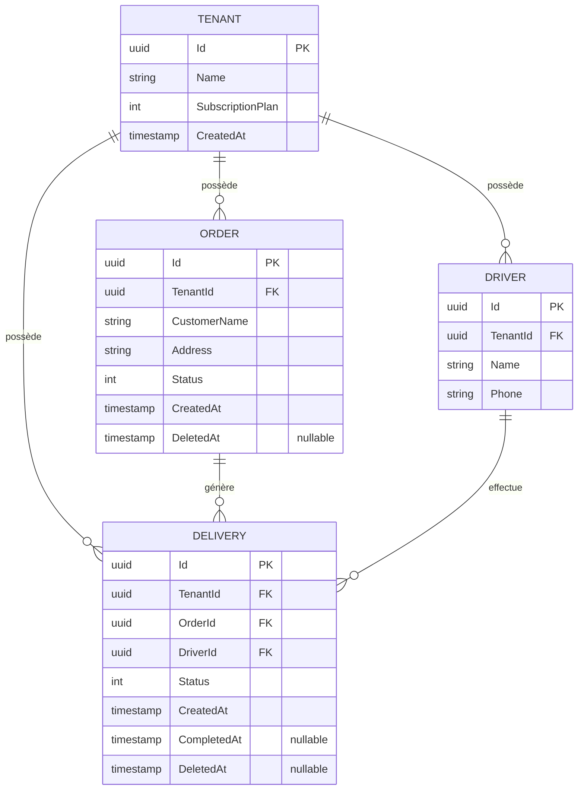

# Modèle de Données - Trackly

## Vue d'ensemble

Trackly est une application SaaS multi-tenant de gestion de livraisons. Le modèle de données est conçu autour de quatre entités principales : **Tenant**, **Order** (Commande), **Delivery** (Livraison/Tournée), et **Driver** (Chauffeur).

## Diagramme de Classes

## Relations Détaillées

### 1. Tenant (Client/Organisation)

**Description** : Représente une organisation cliente utilisant Trackly. Chaque tenant est isolé des autres.

**Relations** :
- **1:N** avec `Order` : Un tenant peut avoir plusieurs commandes
- **1:N** avec `Delivery` : Un tenant peut avoir plusieurs livraisons
- **1:N** avec `Driver` : Un tenant peut avoir plusieurs chauffeurs

**Propriétés** :
- `Id` : Identifiant unique (Guid)
- `Name` : Nom de l'organisation
- `Plan` : Plan d'abonnement (Starter/Pro)
- `CreatedAt` : Date de création

### 2. Order (Commande)

**Description** : Représente une commande client à livrer. Une commande peut exister sans livraison (en attente de planification).

**Relations** :
- **N:1** avec `Tenant` : Chaque commande appartient à un tenant
- **1:N** avec `Delivery` : Une commande peut générer plusieurs livraisons (cas rare mais possible)

**Propriétés** :
- `Id` : Identifiant unique (Guid)
- `TenantId` : Référence au tenant propriétaire
- `CustomerName` : Nom du client
- `Address` : Adresse de livraison
- `Status` : Statut de la commande (Pending, Planned, InTransit, Delivered, Cancelled)
- `CreatedAt` : Date de création
- `DeletedAt` : Date de suppression (soft delete)

**Contraintes** :
- Une commande supprimée (soft delete) ne peut pas être supprimée si elle a des livraisons actives (sauf cascade)
- Les commandes supprimées sont filtrées automatiquement dans les requêtes

### 3. Delivery (Livraison/Tournée)

**Description** : Représente une livraison assignée à un chauffeur. Une "tournée" est un regroupement conceptuel de livraisons partageant le même `DriverId`.

**Relations** :
- **N:1** avec `Tenant` : Chaque livraison appartient à un tenant
- **N:1** avec `Order` : Chaque livraison est liée à une commande
- **N:1** avec `Driver` : Chaque livraison est assignée à un chauffeur

**Propriétés** :
- `Id` : Identifiant unique (Guid)
- `TenantId` : Référence au tenant propriétaire
- `OrderId` : Référence à la commande à livrer
- `DriverId` : Référence au chauffeur assigné
- `Status` : Statut de la livraison (Pending, InProgress, Completed, Failed)
- `CreatedAt` : Date de création
- `CompletedAt` : Date de livraison complétée (nullable)
- `DeletedAt` : Date de suppression (soft delete)

**Contraintes** :
- Une livraison peut être supprimée indépendamment de sa commande
- Les livraisons supprimées sont filtrées automatiquement dans les requêtes

### 4. Driver (Chauffeur)

**Description** : Représente un chauffeur/livreur appartenant à un tenant.

**Relations** :
- **N:1** avec `Tenant` : Chaque chauffeur appartient à un tenant
- **1:N** avec `Delivery` : Un chauffeur peut effectuer plusieurs livraisons

**Propriétés** :
- `Id` : Identifiant unique (Guid)
- `TenantId` : Référence au tenant propriétaire
- `Name` : Nom du chauffeur
- `Phone` : Numéro de téléphone

## Entité Route (Tournée)

**Depuis 2026-02-04** : Une tournée est une **entité en base** `Route` :
- **Route** : Id, TenantId, DriverId, Name (optionnel), CreatedAt, DeletedAt
- **Delivery** possède un `RouteId` (FK vers Route) : chaque livraison créée via « Créer tournée » est rattachée à une Route

**Avantages** :
- Plusieurs tournées distinctes le même jour pour un même chauffeur (matin / après-midi / nuit)
- Tournées de nuit : une seule Route même si les livraisons enjambent minuit
- Nom optionnel de la tournée stocké en base (ex. « Est - Matin », « Nuit 22h-6h »)

## Diagramme Entité-Relation (ERD)

## Isolation Multi-Tenant

Toutes les entités (sauf `Tenant`) implémentent l'interface `ITenantIsolated` qui garantit :
- L'isolation des données par tenant
- Le filtrage automatique via Global Query Filters dans Entity Framework
- La sécurité au niveau de la base de données

**Principe** : Shared Database, Shared Schema avec isolation par `TenantId`

## Cardinalités

| Relation | Cardinalité | Description |
|----------|-------------|-------------|
| Tenant → Order | 1:N | Un tenant peut avoir plusieurs commandes |
| Tenant → Delivery | 1:N | Un tenant peut avoir plusieurs livraisons |
| Tenant → Driver | 1:N | Un tenant peut avoir plusieurs chauffeurs |
| Order → Delivery | 1:N | Une commande peut générer plusieurs livraisons |
| Driver → Delivery | 1:N | Un chauffeur peut effectuer plusieurs livraisons |

## Contraintes Métier

1. **Soft Delete** : Toutes les entités utilisent `DeletedAt` pour la suppression logique
2. **Isolation** : Toutes les requêtes sont automatiquement filtrées par `TenantId`
3. **Dépendances** : Une commande ne peut être supprimée si elle a des livraisons actives (sauf cascade)
4. **Indépendance** : Les livraisons peuvent être supprimées indépendamment de leur commande
