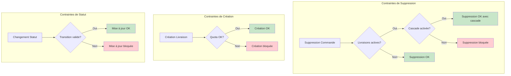

# Règles Métier - Trackly

## Règles Générales

### 1. Isolation Multi-Tenant

**Règle** : Toutes les données sont isolées par tenant.

**Implémentation** :
- Toutes les entités (sauf `Tenant`) implémentent `ITenantIsolated`
- Filtrage automatique par `TenantId` via Global Query Filters
- Vérification du `TenantId` dans tous les endpoints

**Contrainte** : Un utilisateur ne peut jamais accéder aux données d'un autre tenant.

### 2. Soft Delete

**Règle** : Toutes les suppressions sont logiques (soft delete).

**Implémentation** :
- Champ `DeletedAt` nullable sur toutes les entités supprimables
- Filtrage automatique : `WHERE DeletedAt IS NULL`
- Les données supprimées restent en base pour traçabilité

**Avantages** :
- Historique complet
- Possibilité de restauration
- Cohérence des données

### 3. Quotas et Billing

**Règle** : Vérification du quota avant chaque création de livraison.

**Plans** :
- **Starter** (Gratuit) : 20-25 livraisons/mois maximum
- **Pro** (Payant) : Illimité

**Implémentation** :
- Service `IBillingService` vérifie le quota mensuel
- Blocage si quota dépassé (403 Forbidden)
- Vérification à chaque création de commande et livraison

## Règles de Suppression

### Suppression de Livraison

**Règle** : Les livraisons peuvent être supprimées indépendamment.

**Contraintes** :
- ✅ Aucune vérification de dépendances
- ✅ La commande associée reste intacte
- ✅ Suppression immédiate après confirmation

**Workflow** :
```
Sélection → Confirmation → Soft Delete → Succès
```

### Suppression de Commande

**Règle** : Les commandes avec livraisons actives nécessitent une action explicite.

**Contraintes** :
- ⚠️ Bloquée si livraisons actives existent
- ✅ Option cascade disponible (`forceDeleteDeliveries`)
- ✅ Suppression immédiate si aucune livraison active

**Workflow** :
```
Sélection → Vérification livraisons → {
    Aucune livraison : Suppression immédiate ✅
    Livraisons actives : {
        Sans cascade : Bloqué ❌
        Avec cascade : Suppression commande + livraisons ✅
    }
}
```

## Règles de Création

### Création de Commande

**Prérequis** :
- `CustomerName` obligatoire
- `Address` obligatoire
- Quota mensuel disponible

**Validation** :
- Trim des chaînes
- Vérification quota avant création
- Statut initial : `Pending`

### Création de Livraison (Tournée)

**Prérequis** :
- Commande existante et valide
- Driver existant et valide
- Quota mensuel disponible (pour chaque livraison)

**Validation** :
- Vérification existence commande
- Vérification existence driver
- Vérification quota (par livraison)
- Statut initial : `Pending`

**Création Batch** :
- Création de plusieurs livraisons en une transaction
- Vérification quota pour chaque livraison
- Rollback si aucune livraison ne peut être créée

## Règles de Statut

### Statut de Commande

**Transitions autorisées** :
- `Pending` → `Planned` : Quand une livraison est créée
- `Planned` → `InTransit` : Quand une livraison démarre
- `InTransit` → `Delivered` : Quand toutes les livraisons sont complétées
- `Any` → `Cancelled` : Annulation manuelle (sauf `Delivered`)

**Règle automatique** :
- Le statut de la commande est mis à jour automatiquement selon l'état des livraisons

### Statut de Livraison

**Transitions autorisées** :
- `Pending` → `InProgress` : Démarrage tracking GPS
- `InProgress` → `Completed` : Validation livraison
- `Any` → `Failed` : Échec (retour, problème)

**Règle** :
- Le statut est mis à jour manuellement par le driver via l'API

## Règles de Tracking

### Géolocalisation

**Règle** : Le tracking GPS est optionnel mais recommandé.

**Implémentation** :
- Service GPS dans le Driver PWA
- Envoi position toutes les 5 secondes
- SignalR pour diffusion temps réel

**Contraintes** :
- Nécessite permission navigateur
- Peut échouer si GPS désactivé
- Continue même si erreur GPS temporaire

### SignalR

**Règle** : Connexion par groupe de livraison.

**Implémentation** :
- `JoinDeliveryGroup(deliveryId)` : Rejoindre le groupe
- `UpdateLocation(deliveryId, lat, lng)` : Mettre à jour position
- Broadcast à tous les clients du groupe

**Sécurité** :
- Vérification `TenantId` dans le Hub
- Isolation par tenant

## Règles d'Affichage

### Filtrage Automatique

**Règle** : Les entités supprimées ne sont jamais affichées.

**Implémentation** :
- Filtre `WHERE DeletedAt IS NULL` dans toutes les requêtes
- Global Query Filters dans Entity Framework

### Regroupement Tournées

**Règle** : Les tournées sont regroupées par `DriverId` et date.

**Implémentation** :
- Regroupement logique côté frontend
- Pas d'entité `Route` en base
- Affichage dynamique selon les livraisons

## Contraintes Techniques

### Base de Données

- **PostgreSQL** : Base de données unique
- **Shared Schema** : Tous les tenants partagent le même schéma
- **Isolation** : Par `TenantId` uniquement

### API

- **Minimal APIs** : Pas de contrôleurs MVC
- **Validation** : FluentValidation (à implémenter)
- **CORS** : Configuré pour développement et production

### Frontend

- **SvelteKit** : Framework frontend business
- **Svelte 5** : Runes API pour réactivité
- **PWA** : Application driver avec service worker

## Diagramme de Contraintes


