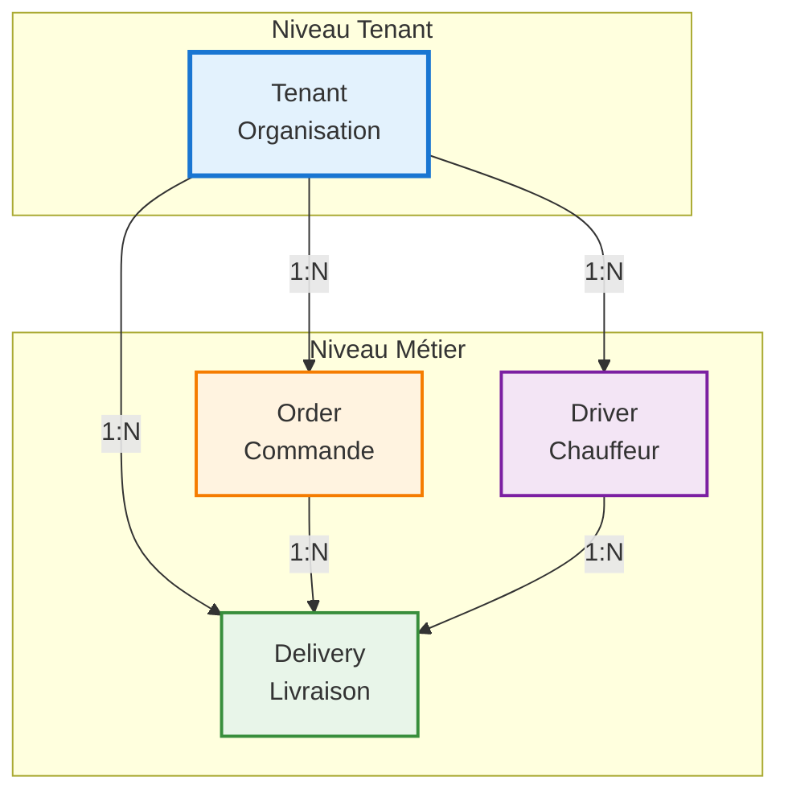
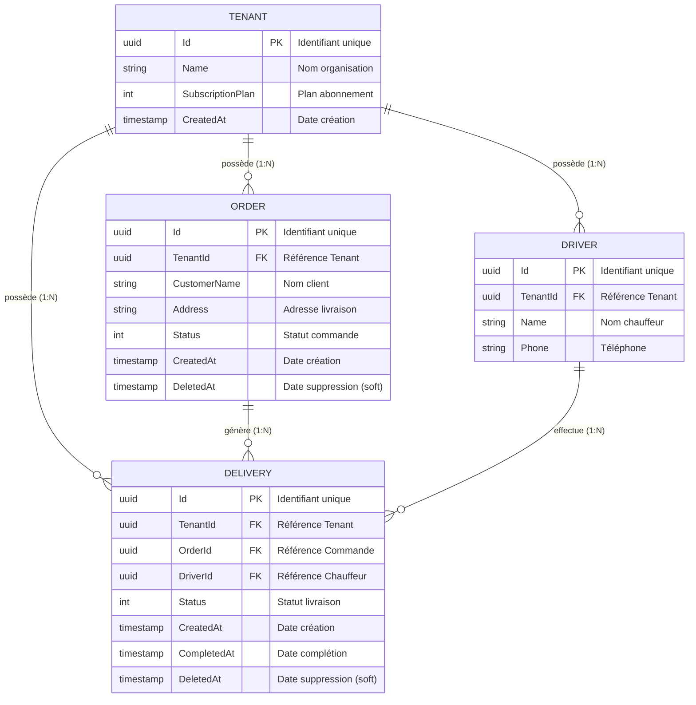
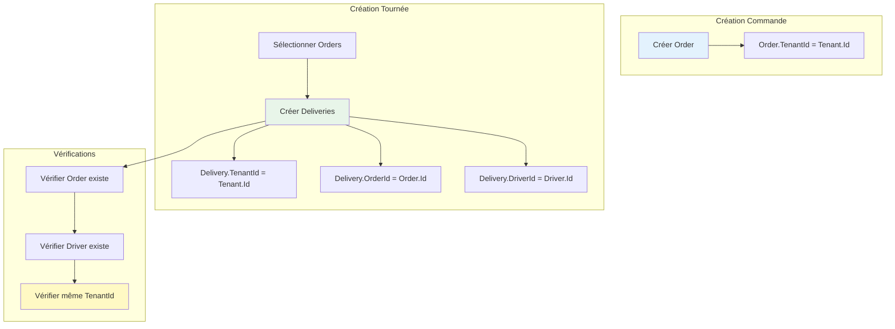
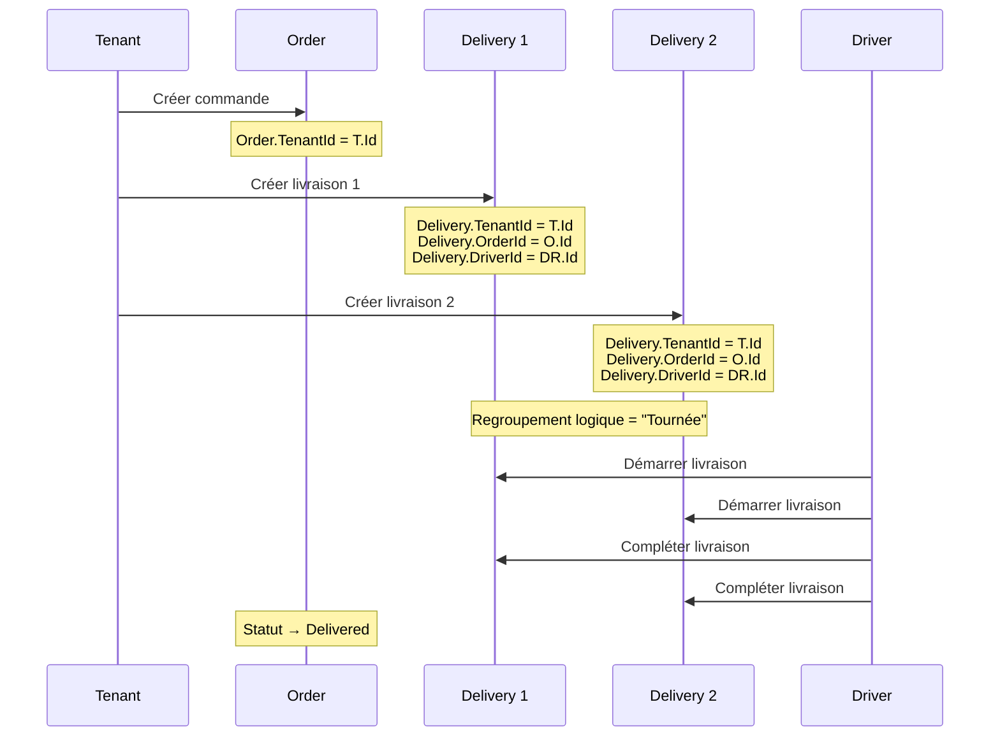

# Relations entre Entités - Trackly

## Vue d'ensemble

Ce document détaille les relations entre les différentes entités du système Trackly.

## Diagramme de Relations Complet



## Relations Détaillées

### 1. Tenant ↔ Order (1:N)

**Type** : Relation de propriété

**Description** : Un tenant (organisation) possède plusieurs commandes.

**Cardinalité** :
- **1 Tenant** → **N Orders** (un tenant peut avoir plusieurs commandes)
- **N Orders** → **1 Tenant** (chaque commande appartient à un seul tenant)

**Implémentation** :
- Clé étrangère : `Order.TenantId` → `Tenant.Id`
- Filtrage automatique par Global Query Filter
- Isolation garantie au niveau base de données

**Exemple** :
```
Tenant "Atelier Moreau" (ID: abc-123)
  ├── Order "Commande Client A" (TenantId: abc-123)
  ├── Order "Commande Client B" (TenantId: abc-123)
  └── Order "Commande Client C" (TenantId: abc-123)
```

**Contraintes** :
- Une commande ne peut pas exister sans tenant
- Suppression d'un tenant → cascade sur toutes ses commandes (non implémenté, soft delete uniquement)

### 2. Tenant ↔ Delivery (1:N)

**Type** : Relation de propriété

**Description** : Un tenant possède plusieurs livraisons.

**Cardinalité** :
- **1 Tenant** → **N Deliveries**
- **N Deliveries** → **1 Tenant**

**Implémentation** :
- Clé étrangère : `Delivery.TenantId` → `Tenant.Id`
- Filtrage automatique par Global Query Filter

**Exemple** :
```
Tenant "Atelier Moreau" (ID: abc-123)
  ├── Delivery "Livraison 1" (TenantId: abc-123)
  ├── Delivery "Livraison 2" (TenantId: abc-123)
  └── Delivery "Livraison 3" (TenantId: abc-123)
```

### 3. Tenant ↔ Driver (1:N)

**Type** : Relation de propriété

**Description** : Un tenant possède plusieurs chauffeurs.

**Cardinalité** :
- **1 Tenant** → **N Drivers**
- **N Drivers** → **1 Tenant**

**Implémentation** :
- Clé étrangère : `Driver.TenantId` → `Tenant.Id`
- Filtrage automatique par Global Query Filter

**Exemple** :
```
Tenant "Atelier Moreau" (ID: abc-123)
  ├── Driver "Alex Dupont" (TenantId: abc-123)
  ├── Driver "Marie Martin" (TenantId: abc-123)
  └── Driver "Jean Durand" (TenantId: abc-123)
```

### 4. Order ↔ Delivery (1:N)

**Type** : Relation de dépendance fonctionnelle

**Description** : Une commande peut générer plusieurs livraisons (cas rare mais possible).

**Cardinalité** :
- **1 Order** → **N Deliveries** (une commande peut avoir plusieurs livraisons)
- **N Deliveries** → **1 Order** (chaque livraison est liée à une seule commande)

**Implémentation** :
- Clé étrangère : `Delivery.OrderId` → `Order.Id`
- Pas de contrainte de cascade en base (soft delete)

**Exemple** :
```
Order "Commande Client A" (ID: order-1)
  ├── Delivery "Livraison 1" (OrderId: order-1)
  ├── Delivery "Livraison 2" (OrderId: order-1) [cas rare: relivraison]
  └── Delivery "Livraison 3" (OrderId: order-1) [cas rare: relivraison]
```

**Cas d'usage** :
- **Cas normal** : 1 commande = 1 livraison
- **Cas exceptionnel** : 1 commande = N livraisons (relivraison, problème, etc.)

**Contraintes métier** :
- ⚠️ Une commande ne peut être supprimée si elle a des livraisons actives (sauf cascade)
- ✅ Les livraisons peuvent être supprimées indépendamment de la commande
- ✅ Une commande peut exister sans livraison (en attente de planification)

### 5. Driver ↔ Delivery (1:N)

**Type** : Relation d'assignation

**Description** : Un chauffeur peut effectuer plusieurs livraisons.

**Cardinalité** :
- **1 Driver** → **N Deliveries** (un chauffeur peut avoir plusieurs livraisons)
- **N Deliveries** → **1 Driver** (chaque livraison est assignée à un seul chauffeur)

**Implémentation** :
- Clé étrangère : `Delivery.DriverId` → `Driver.Id`
- Pas de contrainte de cascade en base

**Exemple** :
```
Driver "Alex Dupont" (ID: driver-1)
  ├── Delivery "Livraison A" (DriverId: driver-1)
  ├── Delivery "Livraison B" (DriverId: driver-1)
  └── Delivery "Livraison C" (DriverId: driver-1)
  
  → Regroupement logique = "Tournée d'Alex"
```

**Concept de Tournée** :
- Une "tournée" est un regroupement logique de livraisons partageant le même `DriverId`
- Pas d'entité `Route` en base de données
- Regroupement effectué côté frontend pour l'affichage

**Contraintes** :
- Une livraison doit toujours avoir un driver assigné
- Un driver peut avoir 0 livraison (pas de livraison assignée)

## Diagramme de Relations avec Cardinalités



## Matrice des Relations

| Entité Source | Relation | Entité Cible | Cardinalité | Type | Contrainte |
|---------------|----------|--------------|-------------|------|------------|
| Tenant | possède | Order | 1:N | Propriété | Obligatoire |
| Tenant | possède | Delivery | 1:N | Propriété | Obligatoire |
| Tenant | possède | Driver | 1:N | Propriété | Obligatoire |
| Order | génère | Delivery | 1:N | Dépendance | Optionnelle |
| Driver | effectue | Delivery | 1:N | Assignation | Obligatoire |

## Règles de Cohérence

### Règle 1 : Isolation Tenant

**Principe** : Toutes les relations respectent l'isolation multi-tenant.

**Vérification** :
- Toutes les entités liées doivent avoir le même `TenantId`
- Vérification dans les endpoints API
- Filtrage automatique par Global Query Filters

### Règle 2 : Dépendances de Suppression

**Principe** : Les suppressions respectent les dépendances.

**Règles** :
- ✅ Livraison → Peut être supprimée indépendamment
- ⚠️ Commande → Bloquée si livraisons actives (sauf cascade)
- ✅ Driver → Peut être supprimé (les livraisons restent avec DriverId)

### Règle 3 : Intégrité Référentielle

**Principe** : Les clés étrangères doivent toujours référencer des entités existantes.

**Vérifications** :
- `Delivery.OrderId` → Doit exister dans `Orders`
- `Delivery.DriverId` → Doit exister dans `Drivers`
- Vérification avant création de livraison

## Diagramme de Flux de Données



## Exemple Concret : Cycle de Vie Complet


