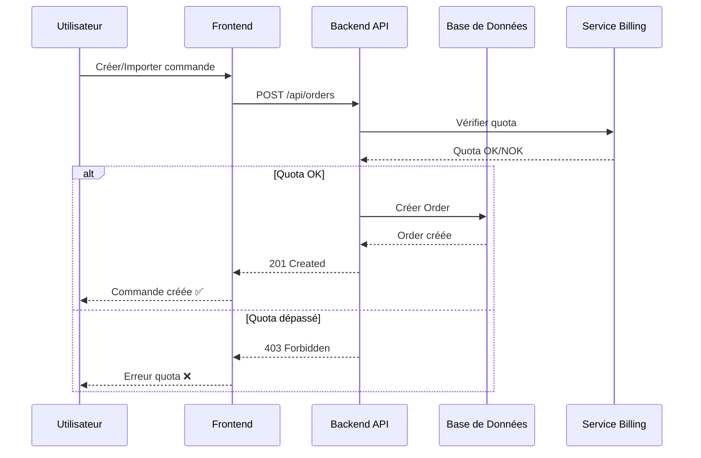
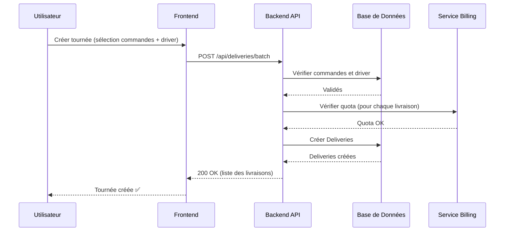
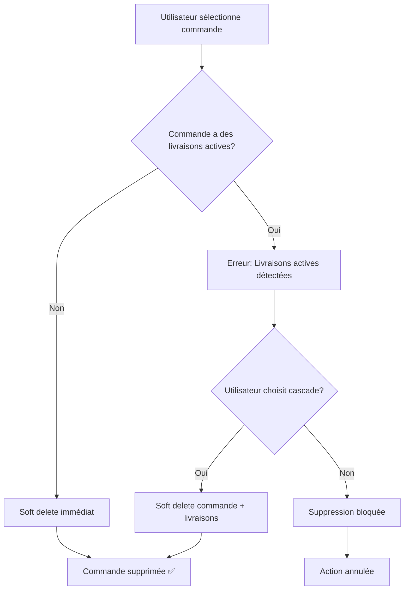
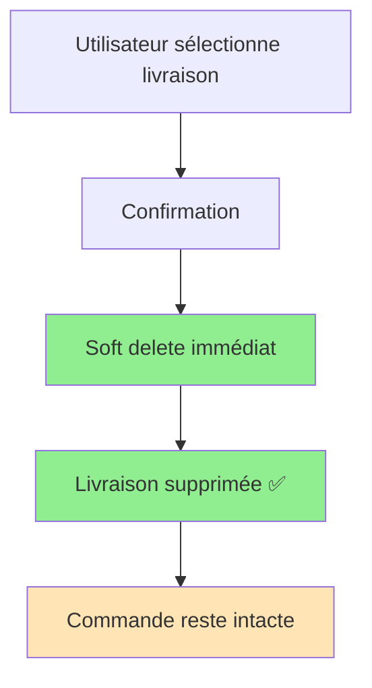
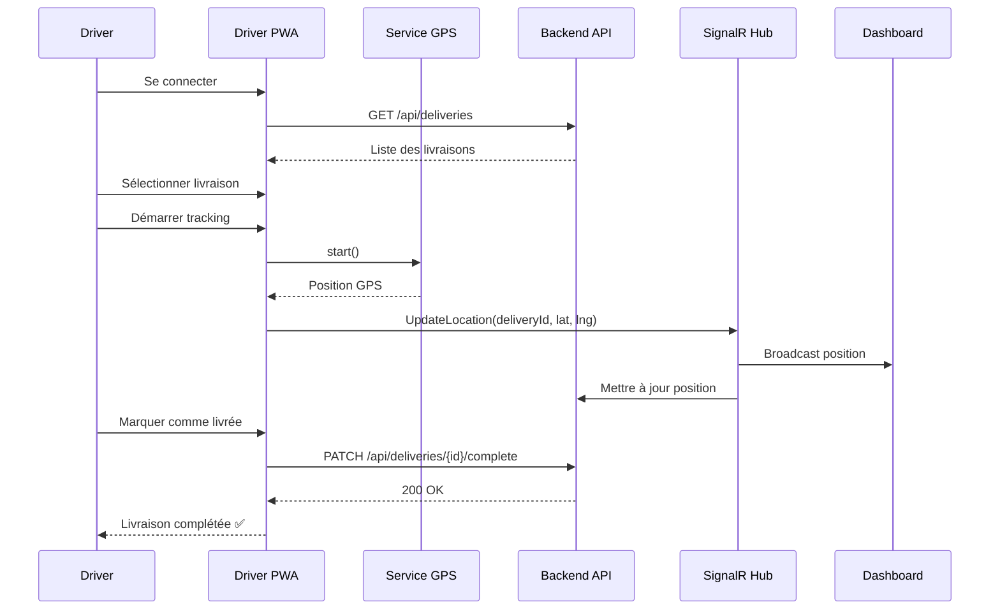
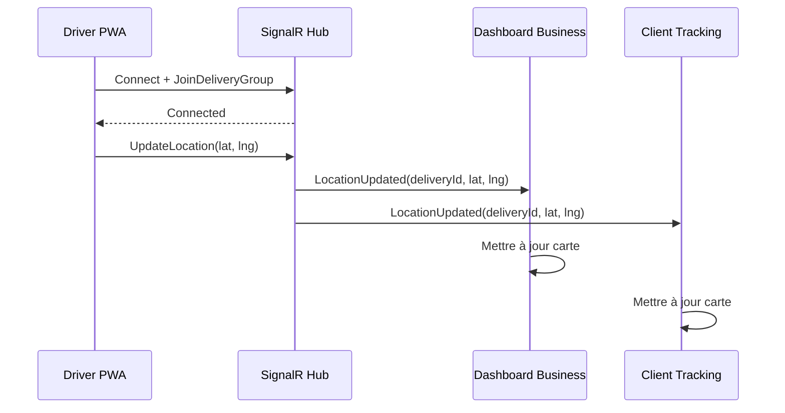
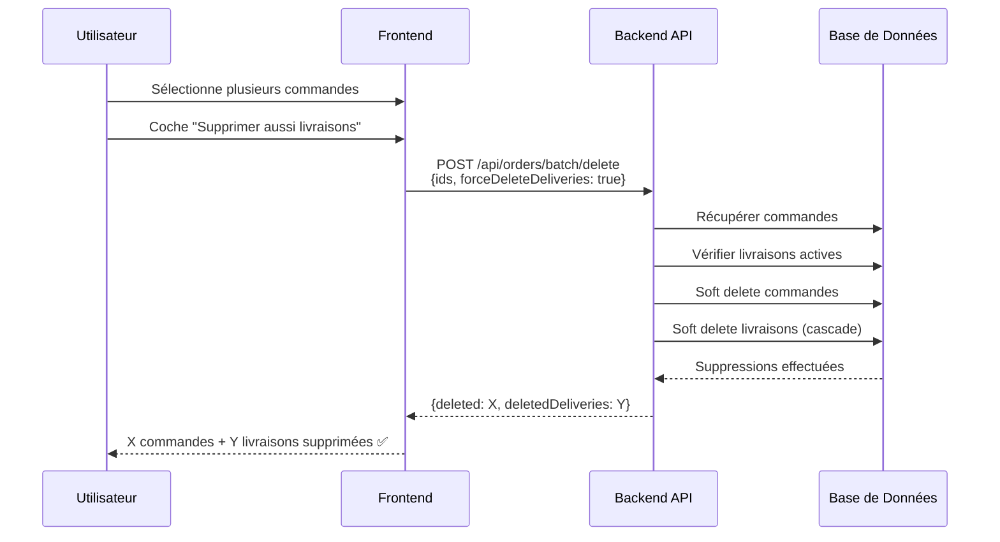

# Workflows Métier - Trackly

## Vue d'ensemble des Processus

Ce document décrit les principaux workflows métier de l'application Trackly.

## 1. Workflow de Création de Commande

## 2. Workflow de Création de Tournée (Livraisons)

## 3. Workflow de Suppression de Commande

## 4. Workflow de Suppression de Livraison

## 5. Workflow de Livraison (Driver PWA)

## 6. Workflow de Tracking Temps Réel

## 7. Workflow Complet : De la Commande à la Livraison

```mermaid
flowchart LR
    A[Commande créée] --> B[Statut: Pending]
    B --> C[Création tournée]
    C --> D[Livraisons créées]
    D --> E[Statut: Pending]
    E --> F[Driver démarre]
    F --> G[Statut: InProgress]
    G --> H[Tracking GPS actif]
    H --> I[Livraison complétée]
    I --> J[Statut: Completed]
    J --> K[Commande: Delivered]
    
    style A fill:#E3F2FD
    style B fill:#FFF3E0
    style E fill:#FFF3E0
    style G fill:#FFF9C4
    style J fill:#C8E6C9
    style K fill:#C8E6C9
```

## 8. Workflow de Suppression Multiple avec Cascade

